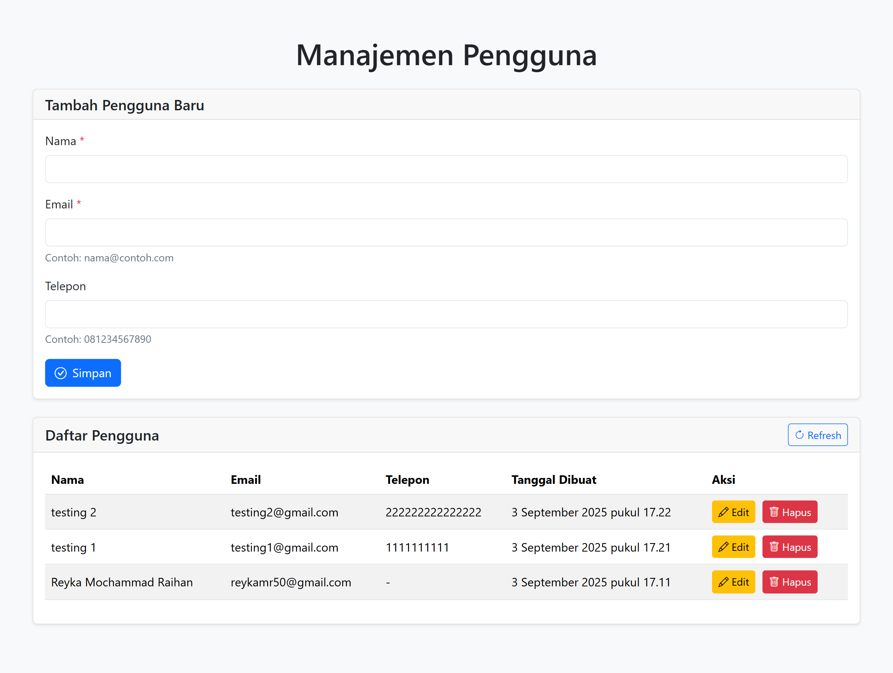

# 👩🏻‍🤝‍👩🏻 Aplikasi CRUD Pengguna


Aplikasi manajemen pengguna sederhana dengan fitur Create, Read, Update, dan Delete (CRUD) yang dibangun menggunakan HTML, Bootstrap 5 Vanilla JavaScript, Node.js, dan MySQL.

## 🖼️ Tampilan Aplikasi
<p align="center">
  
</p>

## ✨ Fitur
- ➕ Tambah data pengguna baru
- 📋 Lihat daftar pengguna
- ✏️ Edit data pengguna
- ❌ Hapus data pengguna
- ✅ Validasi form
- 🔔 Notifikasi menggunakan SweetAlert2
- 📱 Responsive design dengan Bootstrap 5
- ⏳ Loading indicator

## 🛠️ Teknologi yang Digunakan
### 🎨 Frontend
- HTML5
- Bootstrap 5.3.8
- Vanilla JavaScript
- SweetAlert2

### ⚙️ Backend
- Node.js
- Express.js
- MySQL2

### 🗃️ DBMS
- MySQL

## 🚀 Instalasi dan Setup
### 📌 Prerequisites
- Node.js (v16 LTS atau lebih baru)
- MySQL Server
- npm

### 1️⃣ Clone Repository
```bash
git clone https://github.com/ReykaMR/crud-app-javascript.git
cd crud-app-javascript
```

### 2️⃣ Setup Database
1. Buka phpMyAdmin atau MySQL client
2. Buat database baru dengan nama crud_app_javascript lalu masuk ke dalam database tersebut
3. import file users.sql ke dalam database
4. Atau jalankan query berikut untuk membuat tabel:
```sql
CREATE TABLE users (
    id INT AUTO_INCREMENT PRIMARY KEY,
    name VARCHAR(100) NOT NULL,
    email VARCHAR(100) NOT NULL UNIQUE,
    phone VARCHAR(15),
    created_at TIMESTAMP DEFAULT CURRENT_TIMESTAMP
);
```

### 3️⃣ Setup Backend
1. Masuk ke folder backend:
```bash
cd backend
```
2. Install dependencies:
```bash
npm install
```
3. Tambahkan script berikut di file package.json (bagian "scripts"):
```json
"scripts": {
  "start": "node server.js",
  "dev": "nodemon server.js"
}
```
4. Konfigurasi database:
- Buka file backend/config/database.js
- Sesuaikan kredensial database dengan setting MySQL masing-masing:
```js
const connection = mysql.createConnection({
  host: 'localhost',
  user: 'root', // Ganti dengan username MySQL masing-masing
  password: '', // Ganti dengan password MySQL masing-masing
  database: 'crud_app_javascript'
});
```
4. Jalankan server:
```bash
npm run dev
```
Server akan berjalan di http://localhost:3000

### 4️⃣ Setup Frontend
1. Buka file frontend/index.html di browser masing-masing
2. Atau jalankan dengan live server (jika menggunakan VS Code)

## ▶️ Cara Menjalankan
1. Jalankan backend:
```bash
cd backend
npm run dev
```
2. Buka frontend di browser:
    - Arahkan ke frontend/index.html 
    - Atau gunakan Live Server di VS Code
3. Pastikan backend (API) sudah berjalan di http://localhost:3000 

## 📡 API Endpoints
- GET /api/users - Mendapatkan semua data pengguna
- GET /api/users/:id - Mendapatkan data pengguna berdasarkan ID
- POST /api/users - Menambah data pengguna baru
- PUT /api/users/:id - Mengupdate data pengguna
- DELETE /api/users/:id - Menghapus data pengguna

## 🐞 Troubleshooting
1. Error koneksi database:
    - Pastikan MySQL server sedang berjalan
    - Periksa kredensial database di backend/config/database.js
2. Port sudah digunakan:
    - Ubah port di file backend/server.js jika port 3000 sudah digunakan
3. CORS error:
    - Pastikan backend sudah berjalan sebelum membuka frontend
